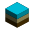

# Deposit
Graph-based data storage and exchange

Created on 29. 4. 2013

### Author of the code:
Peter Demján (peter.demjan@gmail.com)

Institute of Archaeology of the Czech Academy of Sciences, Prague, v.v.i.

## Table of Contents
1. [Deposit (DEP) RDF Schema](#rdf_schema)
2. [DLabel classes](#dlabel_classes)
3. [Concepts](#concepts)
4. [RDFLib definitions](#rdflib_definitions)
5. [Deposit graph RDF definitions](#graph_rdf_definitions)
6. [Querying](#querying)
7. [Acknowledgements](#acknowledgements)
8. [License](#license)

## Deposit (DEP) RDF Schema: 

### Deposit classes:

dep:Node - Node of a graph.

dep:Edge - Edge of a graph.

dep:Object - Unlabeled Node. Represents the analytical unit.

dep:Class - Labeled Node. Generalization (synthetical) unit. Only one Class with a specific label can exist.

dep:Member - Unlabeled Edge. Membership of an Object or Class in a Class.

dep:Relation - Labeled Edge. Connection between an Object and a Class, two Objects or two Classes. Only one Relation between specific Nodes and with a specific label can exist.

dep:Descriptor - Labeled Edge. Relation between two Classes. The source Class is a Descriptor of the target Class.

dep:Order - rdf:Seq. Ordering of Nodes as specified by their position in a container of this class.

dep:Changed - rdfs:Literal. Time of last change of a Deposit graph.

dep:LocalFolder - rdfs:Resource. IRI of the local folder to store resources.

dep:Images - rdf:Bag. List of resources which are images.

dep:Version - rdfs:Literal. Version of Deposit used to create a graph.

dep:User - User of a Deposit graph.

dep:Event - Event documenting modification of a Deposit graph.

dep:Event_add - Add Object or Class to graph. Arguments: key; key = id of Object or name of Class.

dep:Event_delete - Delete Object or Class from graph. Arguments: key; key = id of Object or name of Class.

dep:Event_rename - Rename Class. Arguments: old_name, new_name.

dep:Event_switch_order - Switch order of Classes. Arguments: name1, name2.

dep:Event_add_descriptor - Add Descriptor to Object or Class. Arguments for Class: name. Arguments for Object: name, value, dtype; dtype = name of DLabel class.

dep:Event_rename_descriptor - Rename Descriptor for a specific Class or Object. Arguments: old_name, new_name.

dep:Event_del_descriptor - Delete Descriptor from a specific Class or Object. Arguments: name.

dep:Event_add_relation - Add Relation between Classes or Objects. Arguments for Classes: relation_label, target_name. Arguments for Objects: relation_label, target_id, weight.

dep:Event_del_relation - Delete Relation between Classes or Objects. Arguments for Classes: relation_label, target_name. Arguments for Objects: relation_label, target_id.

dep:Event_set_relation_weight - Set weight of Relation between Objects. Arguments for Objects: relation_label, target_id, weight.

dep:Event_add_subclass - Add Subclass to Class. Arguments: name.

dep:Event_del_subclass - Delete Subclass from Class. Arguments: name.

dep:Event_add_object - Add Object to Class. Arguments: id.

dep:Event_del_object - Delete Object from Class. Arguments: id.

dep:Event_add_class - Add Class to Object. Arguments: name.

dep:Event_del_class - Delete Class from Object. Arguments: name.

dep:Query - User defined Query.

dep:UserTool - User tool.

dep:UserElement - User tool element.

dep:UserElementList - User tool containing multiple elements.

dep:QueryTool - Query user tool.

dep:SearchForm - Search Form user tool.

dep:EntryForm - Entry Form user tool.

dep:UserLabeledElement - Labeled user tool element.

dep:UserSelect - User tool element specifying a Class and Descriptor.

dep:UserUnique - User tool element specifying a Class for which to always create unique objects.

dep:UserControl - Control user tool element.

dep:LineEdit - Line Edit user tool element.

dep:PlainTextEdit - Plain Text Edit user tool element.

dep:ComboBox - Combo Box Edit user tool element.

dep:CheckBox - Check Box Edit user tool element.

dep:Group - Group of user tool elements.

dep:MultiGroup - Group of user tool elements allowing to specify multiple Objects.

dep:ColumnBreak - Column Break user tool element.

dep:Select - Select user tool element.

dep:Unique - Unique user tool element.

### Deposit properties:

dep:label - Label of a Node or Edge. Can be numeric, string, resource or geometry.

dep:source - Indicates the source Node of an Edge.

dep:target - Indicates the target Node of an Edge.

dep:geotag - Geometric information (wkt) further specifying a resource representing the label of an Edge. Coordinates represent pixels of the raster, [0,0] being the bottom-left corner.

dep:weight - Weight of a Relation.

dep:description - Additional description of a Class, Property or Relation.

dep:projection - Geographic projection as wkt in OGC or ESRI format.

dep:worldfile_A..F - ESRI world file parameters used for georeferencing raster image resources.

dep:username - User name.

dep:password - User password.

dep:time - Time stamp of an Event.

dep:user - Indicates a User of a Deposit graph who performed an Event.

dep:node -Indicates class of Node targeted by Event.

dep:key - Key specifying a Node (Object id or Class label) involved in an Event.

dep:arguments - Arguments of a function performed on a Deposit Node involved in an Event specified as a JSON string.

dep:class - Indicates Class of the user tool element.

dep:descriptor - Indicates Descriptor of the user tool element.

dep:stylesheet - Indicates CSS style of the user tool element.

## DLabel classes: 

DNone - No value.

DString - String value.

DResource - Local or online Resource.

DGeometry - Geometry

DDateTime - Date and Time

## Concepts: 

Subclass: A Class which is a Member of another Class.

Descriptor: A Class connected to an Object by a Relation is a Descriptor of the Object and also of its Class. Only one identical Descriptor for a specific Object can exist.

Localy stored files are renamed to [uuid].[ext] and the original names are stored as triplets: uri rdfs:label Literal(name)

Resources are specified by an uri representing a file or online resource; file uri: "http://[Deposit server url]/deposit/file/[graph identifier]/[uuid].[ext]" or e.g. "http://some_server/filename.ext"

Geometry is specified by WKT and optionally EPSG code(s) in GeoSPARQL format stored as wktLiteral.
	e.g.: "<http://www.opengis.net/def/crs/EPSG/0/[srid]> Point(-83.1 34.4)"
	e.g.: "<http://www.opengis.net/def/crs/OGC/1.3/CRS84> Polygon((-83.2 34.3, -83.0 34.3, -83.0 34.5, -83.2 34.3))"
	a vertical coordinate system can also be specified:
		e.g.: "<http://www.opengis.net/def/crs/EPSG/0/[horizontal srid]> <http://www.opengis.net/def/crs/EPSG/0/[vertical srid]> Point(-83.1 34.4)"

Time stamp of last change of the Deposit graph is stored in a Literal

## RDFLib definitions: 

The Deposit RDF Schema IRI (Internationalized Resource Identifier):
dep = http://future_url/2017/04/deposit-schema#

A Deposit graph RDF source IRI:
remote graph (served by a Deposit server):
	gra = http://[Deposit server url]/deposit/graph/[graph identifier]#
local graph (stored in a file system):
	gra = file:///[path/to/data]/[graph identifier]#

The GeoSPARQL schema IRI:
ogc = http://www.opengis.net/ont/geosparql#

## Deposit graph RDF definitions: 

Object:
	
	gra:[id_obj] rdf:type dep:Object
	
	id_obj is an Object
	id_obj: obj_1, obj_2, ...

Class:
	
	gra:[id_cls] rdf:type dep:Class
	gra:[id_cls] dep:label Literal(label)
	
	id_cls is a Class named label
	id_cls: cls_0, cls_1, cls_2, ...

Member:
	
	gra:[id_mem] rdf:type dep:Member
	gra:[id_mem] dep:source gra:[id_cls1]
	gra:[id_mem] dep:target gra:[id_obj / id_cls2]
	
	Class id_cls1 has a member Object id_obj or Class id_cls2
	id_mem: mem_0, mem_1, mem_2, ...

Relation:
    
	gra:[id_rel] rdf:type dep:Relation
	gra:[id_rel] dep:label Literal(label) / URIRef(label) / wktLiteral(label)
	gra:[id_rel] dep:source gra:[id_obj1 / id_cls1]
	gra:[id_rel] dep:target gra:[id_obj2 / id_cls2]
	
	id_rel is a Relation named label
	Object id_obj1 or Class id_cls1 is connected to Object id_obj2 or Class id_cls2 by Relation id_rel
	label can be of type URIRef or wktLiteral only for relations between two Objects or two Classes
	a Relation between two Classes is virtual, representing a Relation between Objects of those Classes
	id_rel: rel_0, rel_1, rel_2, ...

Descriptor:
	
	gra:[id_dsc] rdf:type dep:Descriptor
	gra:[id_dsc] dep:source gra:[id_cls1]
	gra:[id_dsc] dep:target gra:[id_cls2]

	Class id_cls1 is a Descriptor of Class id_cls2
	id_dsc: dsc_0, dsc_1, dsc_2, ...

geotag:
	
	gra:[id_rel] dep:geotag wktLiteral(wkt)
	
	geometric information wkt further specifies the Relation id_rel

weight:
	
	gra:[id_rel] dep:weight Literal(label)
	
	weight of the Relation id_rel

Order:
	
	gra:order rdf:type dep:Order
	gra:order rdf:_n gra:[id_node]
	
	Node id_node is at the n-th position in Ordering

Changed:
	
	gra:changed rdf:type dep:Changed
	gra:changed rdf:value Literal(timestamp)
	
	The graph was last changed at time timestamp

LocalFolder:
	
	URIRef(IRI) rdf:type dep:LocalFolder
	
	IRI of the local folder to store resources.

Images:
	
	gra:images rdf:type dep:Images
	gra:images rdf:_n URIRef(label)

Version:
	
	gra:version rdf:type dep:Version
	gra:version rdf:value Literal(version)
	
	The graph was created using Deposit of the specified version.

description:
	
	gra:[id] dep:description Literal(d)
	
	d is a description of Class or Relation id

projection:
	
	URIRef(uri) dep:projection Literal(wkt)
	
	geographic projection as wkt in OGC or ESRI format of a local or remote raster image resource

worldfile_A..F:
	
	URIRef(uri) dep:worldfile_A Literal(v)
	URIRef(uri) dep:worldfile_D Literal(v)
	URIRef(uri) dep:worldfile_B Literal(v)
	URIRef(uri) dep:worldfile_E Literal(v)
	URIRef(uri) dep:worldfile_C Literal(v)
	URIRef(uri) dep:worldfile_F Literal(v)
	
	v is a floating point value of ESRI world file parameters A/D/B/E/C/F
	uri is the uri of a local or remote raster image resource
	
	A (line 1): pixel size in the x-direction in map units/pixel.
	D (line 2): rotation about y-axis.
	B (line 3): rotation about x-axis.
	E (line 4): pixel size in the y-direction in map units.
	C (line 5): x-coordinate of the center of the upper left pixel.
	F (line 6): y-coordinate of the center of the upper left pixel.

User:
	
	gra:[id_usr] rdf:type dep:User
	gra:[id_usr] dep:username Literal(username)
	gra:[id_usr] dep:password Literal(password)
	
	id_usr is a User specified by username and password

Event:
	
	gra:[id_evt] rdf:type dep:Event
	gra:[id_evt] dep:time Literal(time)
	gra:[id_evt] dep:user gra:[id_usr]
	gra:[id_evt] dep:node dep:Object / dep:Class
	gra:[id_evt] dep:key Literal(key)
	gra:[id_evt] dep:arguments Literal(arguments)
	
	id_evt is an Event documenting modification of a Deposit graph.
	The modification occured at time, was performed by User id_usr, on a Deposit Node or list of Nodes specified by node and key.
	The function performed is specified by the subclass of dep:Event and arguments, where arguments is a JSON encoded list of arguments.

Locally stored file:
	
	URIRef([local name].[ext]) rdfs:label Literal([name].[ext])
	
	the original name of localy stored file [local name].[ext] is [name].[ext]

Query:
	
	gra:[id_qry]	rdf:type	dep:Query
	gra:[id_qry]	rdfs:label	Literal(label)
	gra:[id_qry]	rdf:value	Literal(querystring)

UserElement:
	
	gra:[id_uel]	rdf:type	dep:UserElement

LineEdit:

	gra:[id_uel]	rdf:type	dep:LineEdit
	gra:[id_uel]	dep:stylesheet	Literal(stylesheet)
	gra:[id_uel]	rdfs:label	Literal(label)
	gra:[id_uel]	dep:class	gra:[id_cls]
	gra:[id_uel]	dep:descriptor	gra:[id_cls]

PlainTextEdit:

	gra:[id_uel]	rdf:type	dep:PlainTextEdit
	gra:[id_uel]	dep:stylesheet	Literal(stylesheet)
	gra:[id_uel]	rdfs:label	Literal(label)
	gra:[id_uel]	dep:class	gra:[id_cls]
	gra:[id_uel]	dep:descriptor	gra:[id_cls]

ComboBox:

	gra:[id_uel]	rdf:type	dep:ComboBox
	gra:[id_uel]	dep:stylesheet	Literal(stylesheet)
	gra:[id_uel]	rdfs:label	Literal(label)
	gra:[id_uel]	dep:class	gra:[id_cls]
	gra:[id_uel]	dep:descriptor	gra:[id_cls]

CheckBox:

	gra:[id_uel]	rdf:type	dep:CheckBox
	gra:[id_uel]	dep:stylesheet	Literal(stylesheet)
	gra:[id_uel]	rdfs:label	Literal(label)
	gra:[id_uel]	dep:class	gra:[id_cls]
	gra:[id_uel]	dep:descriptor	gra:[id_cls]

Group:

	gra:[id_uel]	rdf:type	dep:Group
	gra:[id_uel]	dep:stylesheet	Literal(stylesheet)
	gra:[id_uel]	rdfs:label	Literal(label)
	gra:[id_uel]	rdf:_n		gra:[id_uel]

MultiGroup:

	gra:[id_uel]	rdf:type	dep:MultiGroup
	gra:[id_uel]	dep:stylesheet	Literal(stylesheet)
	gra:[id_uel]	rdfs:label	Literal(label)
	gra:[id_uel]	rdf:_n		gra:[id_uel]

ColumnBreak:

	gra:[id_uel]	rdf:type	dep:ColumnBreak

Select:

	gra:[id_uel]	rdf:type	dep:Select
	gra:[id_uel]	dep:class	gra:[id_cls]
	gra:[id_uel]	dep:descriptor	gra:[id_cls]

UserTool:

	gra:[id_utl]	rdf:type	dep:UserTool
	gra:[id_utl]	rdfs:label	Literal(label)

QueryTool:

	gra:[id_utl]	rdf:type	dep:QueryTool
	gra:[id_utl]	rdfs:label	Literal(label)
	gra:[id_utl]	rdf:value	Literal(querystring)

SearchForm:

	gra:[id_utl]	rdf:type	dep:SearchForm
	gra:[id_utl]	rdfs:label	Literal(label)
	gra:[id_utl]	rdf:_n		gra:[id_uel]

EntryForm:

	gra:[id_utl]	rdf:type	dep:EntryForm
	gra:[id_utl]	rdfs:label	Literal(label)
	gra:[id_utl]	rdf:_n		gra:[id_uel]

## Querying: 

### Query string:
	
SELECT [select1], [select2], ... RELATED [relation1], [relation2], ... WHERE [conditions] COUNT [conditions] AS [alias] SUM [select] AS [alias]

    Note: RELATED, WHERE, COUNT .. AS, SUM .. AS are optional

ADD RELATION [relation] FROM [condition] TO [condition]
	
### [select]:
1. [class]
2. [class].[descriptor]

\* instead of class / descriptor means any class / descriptor
!* instead of class means classless objects
\![class] means all classes except [class]

	Examples:
        cls1.descr1
        cls1.*
        *.descr1
        *.*
        !*.descr1
        !cls1.descr1

### [relation]:
[class1].[relation].[class2]

\* instead of class / descriptor / relation means any class / descriptor / relation
!* instead of class / decriptor / relation means no class / descriptor / relation
!class / !descriptor / !relation means all except class / descriptor / relation
    
    Examples:
	    cls1.rel1.cls2
            all objects which are members of cls1, related by rel1 to members of cls2
        *.rel1.cls2
            all objects related by rel1 to members of cls2
        cls1.*.cls2
        !cls1.rel1.cls2
        cls1.!rel1.cls2
        cls1.!*.cls2
        !*.rel1.cls2

If no relations are specified but relations between the specified classes exist, they are automatically added to the query.

	Example:
	"SELECT Class1.Descr1, Class2.Descr2" would be equivalent to "SELECT Class1.Descr1, Class2.Descr2 RELATED Class1.relation1.Class2" if relation1 between Class1 and Class2 exists

### [conditions]:
Python expression, where specific strings can be used as variables:
* [class].[descriptor] as a variable e.g. "WHERE Class1.Descr1 == 8"
* id([class]) as the ID of the Object belonging to the class e.g. "WHERE id(Class1) == 2"
* weight([class1].[relation].[class2]) as weight of the relation e.g. "WHERE weight(Class1.relation.Class2) > 0.5"

### [alias]:
Column name under which to display the quantity. If an alias has the same name as a regular column or another alias, an underscore will be added to it.

### Quoting:
Parts of the query string can be quoted using double quotes to allow class names with a dot e.g. "Cls.1", "Class.One". 
Single quotes denote string constants e.g. "cls1.descr1 == 'one'".

## Acknowledgements: 

Development of this software was supported by OP RDE, MEYS, under the project "Ultra-trace isotope research in social and environmental studies using accelerator mass spectrometry", Reg. No. CZ.02.1.01/0.0/0.0/16_019/0000728.

## License: 

This code is licensed under the [GNU GENERAL PUBLIC LICENSE](https://www.gnu.org/licenses/gpl-3.0.en.html) - see the [LICENSE](LICENSE) file for details
